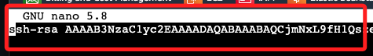
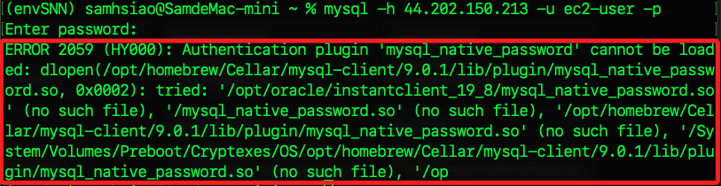

# EC2


<br>

## 建立新實例

1. 點擊 `Launch Instance`。

    

<br>

2. 任意命名，如 `MyWeb0903`，選取主機類行為 `Amazon Linux aws`，AMI 選取 `Amazon 2023 AMI`。

    

<br>

3. 實例類型使用最基礎的設備規格 `t2.micro`。

    

<br>

4. `Key pair` 可選取預設的 `vockey`，這是用來簡化學習過程中連接 EC2 實例的操作，並且與 AWS Academy 帳號相關聯；特別注意，預設的 key 無法下載 `.pem` 文件，之後可手動在本機生成，只是第一次寫入 EC2 主機時，必須使用 AWS 內建的終端機。。

    

<br>

5. 或是點擊 `Create new key pair` 建立新的密鑰對。

    

<br>

6. 任意命名如 `MyKey0903`，類型選擇預設的 `RSA` 或是更安全的 `ED25519` 皆可，然後點擊 `Create key pair`。

    

<br>

7. 點擊後會自動下載 `.pem` 密鑰文件到本地。

    

<br>

8. 其他關於 EC2 的設定都使用預設值，點擊右下角的 `Launch Instance` 建立實例。

    

<br>

9. 回到清單中可見到新增的實例，此時正常狀況下的狀態是 `Running`。

    

<br>

## 建立連線

1. 勾選實例後點擊 `Connect`。

    

<br>

2. 會進入連線頁面，使用或切換到第一個頁籤 `EC2 Instance Connect`，並點擊右下角的 `Connect`，會啟動內建的終端機，預設使用這名稱為 `ec2-user`。

    

<br>

3. 見到以下畫面代表連線成功。

    

<br>

## 自訂連線

1. 可以參考頁籤 `SSH client` 中的說明建立連線。

    

<br>

2. 若要使用下載的 Key 需依官方指示修改 `.pem` 文件權限，實質上是降低權限到 `400`；開啟終端機，輸入 `chmod 400` 之後將 `.pem` 文件拖曳到終端機中。

    

<br>

3. 完成後透過  `ls -l` 指令查詢確實已經變更，`400` 就是 `唯讀`。

    

<br>

4. 紀錄 `Public IPv4 address` 備用。

    

<br>

5. 接著在終端機中使用 `ssh` 指令進行連線。 

    ```bash
    ssh -i <.pem 文件完整路徑> ec2-user@34.201.150.132
    ```

<br>

6. 第一次連入時會詢問是否連線，確認後會將紀錄寫入本機的 `.ssh` 紀錄文件中。

    

<br>

7. 完成連線。

    

<br>

## 寫入本地密鑰到 EC2

1. 可以在本地建立密鑰並將公鑰複製到 EC2，運行以下指令後都按 `ENTER` 使用預設值即可。

    ```bash
    ssh-keygen
    ```

<br>

2. 在前面步驟的 EC2 內建終端機中編輯密鑰文件。

    ```bash
    cd .ssh && nano authorized_keys
    ```

<br>

3. 預設已寫入一則公鑰。

    

<br>

4. 複製本機 `~/.ssh` 資料夾內的任意公鑰文件 `*.pub` 內容，具體選擇哪個公鑰取決於對加密方式的要求，以及相關設定的規劃。

    

<br>

4. 貼到遠端的 `authorized_keys` 文件中，要貼在下一行，免換行符號；儲存 `control+O` 並退出 `control+X`。

    

<br>

## 從本機連線

1. 複製 EC2 實例的 `Public IPv4 address`。

    

<br>

2. 在本機啟動終端機，運行 SSH 指令。

    ```bash
    ssh ec2-user@44.202.150.213
    ```

<br>

3. 第一次連線會詢問。

    

<br>

4. 輸入 `yes` 後完成連線。

    

<br>

5. 查看本機 `~/.ssh` 資料夾內的 `known_hosts` 文件會看到連線資訊已經儲存；特別注意，這個資訊刪除不影響後續的連線，只會再次詢問並記錄，在某些形況下，遠端主機在 IP 不變下更換硬體時，需要在本機手動刪除紀錄文件來排除因衝突而無法連線的問題。

    

<br>

## 安裝相關套件

_透過本機或 EC2 實例中的終端機皆可_

<br>

1. 參考官方的 [Tutorial: Install a LAMP server on AL2023](https://docs.aws.amazon.com/linux/al2023/ug/ec2-lamp-amazon-linux-2023.html)。

    

<br>

2. 更新套件管理器並安裝 Apache。

    ```bash
    sudo dnf update -y && sudo dnf install -y httpd
    ```

<br>

3. 啟動並設置 Apache 在開機時啟動。

    ```bash
    sudo systemctl start httpd && sudo systemctl enable httpd
    ```

<br>

4. 查看 httpd 狀態。

    ```bash
    service httpd status
    ```

<br>

5. 若未啟動，則啟動服務並設定為開機啟動。

    ```bash
    sudo systemctl start httpd && sudo systemctl enable httpd
    ```

<br>

6. 若要檢查是否啟動。

    ```bash
    sudo systemctl is-enabled httpd
    ```

<br>

## 安裝 MariaDB

1. 安裝 MariaDB。

    ```bash
    sudo dnf install -y mariadb105-server
    ```

<br>

2. 啟動並設置 MariaDB 在開機時啟動。

    ```bash
    sudo systemctl start mariadb && sudo systemctl enable mariadb
    ```

<br>

3. 檢查 MariaDB 伺服器的運行狀態。

    ```bash
    sudo systemctl status mariadb
    ```

<br>

## 配置 MariaDB

1. 執行 MariaDB 安全設置腳本來配置 root 密碼和其他安全選項。

    ```bash
    sudo mysql_secure_installation
    ```

<br>

2. 設定與一般 `MySQL` 初始設定皆相同。

    

<br>

3. 除了刷新授權設定輸入 `y` 以外，其餘皆輸入 `n` 即可。

    

<br>

## 安裝 PHP

1. 安裝 PHP 及相關模組。

    ```bash
    sudo dnf install -y php php-mysqlnd
    ```

<br>

2. 重新啟動 Apache 以載入 PHP 模組。

    ```bash
    sudo systemctl restart httpd
    ```

<br>

## 建立網站

_建立簡單的 PHP 網頁_

<br>

1. 編輯文件。

    ```bash
    sudo nano /var/www/html/index.php
    ```

<br>

2. 先寫入任意內容進行測試，儲存 `control+O`、退出 `control+X`。

    ```php
    <?php
    echo "Hello 你好，歡迎來到 AWS 課程測試首頁。";
    ?>
    ```

<br>

## 建立安全組

1. 在 EC2 實例中點擊 `Security`，然後點擊實例的 `Security groups`。

    

<br>

2. 添加 rule。

    

<br>

3. 訪問實例的公共 IP。

    

<br>

## 連線 MariaDB

1. 參考前面的說明，在實例的安全群組中添加規則 `rule`。

    

<br>

2. 透過終端機連線 EC2 實例，編輯 MariaDB 配置文件。

    ```bash
    sudo nano /etc/my.cnf.d/mariadb-server.cnf
    ```

<br>

3. 找到以下行，將預設的註解取消，表示 MariaDB 將接受所有 IP 的連接。

    ```bash
    bind-address = 0.0.0.0
    ```

<br>

4. 修改設定文件後都要重啟服務。

    ```bash
    sudo systemctl restart mariadb
    ```

<br>

5. 因爲預設下是禁止 root 進行遠端連線的，所以要建立新的資料庫使用者；先連線 EC2，並使用 root 權限登入 MariaDB 資料庫。

    ```bash
    sudo mysql -u root -p
    ```

<br>

6. 建立任意名稱使用者，這裡示範同名的 `ec2-user`，密碼設定為 `112233`，並授予來自任何主機的訪問權限。

    ```bash
    CREATE USER 'ec2-user'@'%' IDENTIFIED BY '112233';
    GRANT ALL PRIVILEGES ON *.* TO 'ec2-user'@'%' WITH GRANT OPTION;
    FLUSH PRIVILEGES;
    ```

<br>

7. 進行連線。

    ```bash
    mysql -h 44.202.150.213 -u ec2-user -p
    ```

<br>

8. 若本機 MySQL 與遠端的 MariaDB 存在兼容性或其他 SSL 的問題將無法連線，排除方式很多，這裡暫時不處置。

    

<br>

9. 直接改用 `Workbench` 進行連線。

    

<br>

## 寫入與查詢

1. 使用 Workbench 建立一個資料庫，任意命名如 `testdb` 。

    ```sql
    CREATE DATABASE testdb;
    ```

<br>

2. 接著在實例中連線資料庫。

    ```sql
    sudo mysql -u root -p
    ```

<br>

3. 嘗試切換到 `testdb` 資料庫，藉以驗證資料庫已建立。

    ```sql
    USE testdb;
    ```

<br>

4. 順利切換、確認無誤。

    

<br>

5. 接著使用 SQL 語法建立簡單的資料表 `users`，有兩個欄位 `name` 與 `email`。

    ```sql
    CREATE TABLE users (
        id INT AUTO_INCREMENT PRIMARY KEY,
        name VARCHAR(50),
        email VARCHAR(50)
    );
    ```

<br>

6. 插入兩筆數據如下。

    ```sql
    INSERT INTO users (name, email) VALUES ('Sam Hsiao', 'sam@example.com');
    INSERT INTO users (name, email) VALUES ('Alice Wu', 'alice@example.com');
    ```

<br>

7. 回到 Workbench 中進行查詢，記得先切換檔資料庫，然後下達查詢指令如下。

    ```sql
    USE testdb;
    SELECT * FROM users;
    ```

<br>

8. 結果。

    

<br>

___

_END_


