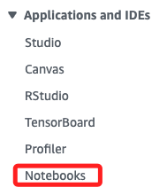
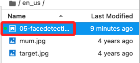
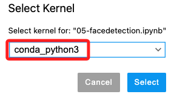

# 人臉識別 

_Module 5 – Introducing Computer Vision (CV)，使用 Amazon SageMaker 建立 Jupyter Notebook 實例，以及使用 Amazon Rekognition 進行已知人臉檢測的步驟_


1. 在 Services 搜尋並開啟 Amazon SageMaker。


2. 點擊左側的 Notebooks。



3. 預設會有一個 `MyNotebook` 的 Notebook 實例，點擊末端 `Open JupyterLab` 打開實例。


4. 在左側文件瀏覽器中找到 `en_us` 並點擊進入。


5. 點擊 `05-facedetection.ipynb` 文件。



6. 預設已經選好 `內核（Kernel）` 為 `conda_python3`。



## 

#### 實驗步驟

1. 建立人臉集合（Collection）：在 Notebook 中運行命令建立一個新的 Amazon Rekognition 人臉集合。
2. 上傳影像並添加到集合：上傳包含已知人臉的影像，並將其添加到人臉集合中。
3. 檢測人臉：使用人臉集合來檢測影像中的已知人臉，並查看檢測結果，包括人臉的邊界框（Bounding Box）。
4. 列出集合中的人臉：查看集合中存儲的所有人臉數據。
5. 刪除人臉集合：完成操作後，刪除集合以清理實驗環境。

#### 實驗完成

- 當您完成所有步驟後，您將成功：
  - 建立一個自定義的 Amazon Rekognition 人臉集合。
  - 將影像添加到自定義集合中。
  - 在影像中檢測已知的人臉。

#### 結束實驗

1. 要結束實驗，請在本頁面頂部選擇 End Lab，然後選擇 Yes 確認。
2. 將會出現一個面板，顯示訊息「DELETE has been initiated...」。
3. 點選面板右上角的 X 來關閉該訊息。

祝賀您完成本實驗！

---

這是基於 AWS Educate Lab 的說明編寫的操作指引，您可以按照此指引在 AWS 上進行面部識別的實驗。


## 若要在本地運行


要在本地運行此 AWS 範例，您需要準備 Python 環境並安裝所需的庫。以下是詳細的步驟指南，並在每個步驟中加入必要的繁體中文註解。

### 準備工作

1. **安裝必要的 Python 庫**：
   - 在終端或命令提示符中運行以下命令來安裝所需的庫：

   ```bash
   pip install boto3 numpy matplotlib scikit-image Pillow
   ```

2. **AWS 凭证配置**：
   - 確保您的本地環境已配置好 AWS CLI 並設置了有效的 AWS 憑證。可以通過以下命令配置：

   ```bash
   aws configure
   ```

   這將提示您輸入 AWS Access Key、Secret Access Key、預設區域（例如 `us-east-1`）和輸出格式。

### 實驗步驟

#### Step 1: 導入 Python 庫

```python
from skimage import io
from skimage.transform import rescale
from matplotlib import pyplot as plt
import boto3
import numpy as np
from PIL import Image, ImageDraw, ImageColor, ImageOps

# 繁體中文註解：
# - skimage 提供影像處理功能
# - matplotlib 用於繪製圖形
# - boto3 是 AWS 的 Python SDK，用於與 AWS 服務交互
# - numpy 用於數據處理
# - PIL 提供影像操作工具
```

#### Step 2: 建立人臉集合

```python
client = boto3.client('rekognition')
collection_id = 'Collection'

response = client.create_collection(CollectionId=collection_id)
print('Collection ARN: ' + response['CollectionArn'])
print('Status Code:' + str(response['StatusCode']))
print('Done...')

# 繁體中文註解：
# - 建立 Amazon Rekognition 人臉集合（Collection）
# - Collection 用於儲存和管理人臉資料
```

#### Step 3: 上傳人臉圖片

```python
filename = "mum.jpg"

# 加載影像
faceimage = io.imread(filename)
plt.imshow(faceimage)

# 確保影像尺寸不超過 4096x4096 像素
if faceimage.shape[0] > 4096 or faceimage.shape[1] > 4096:
    faceimage = rescale(faceimage, 0.50, mode='constant')
    io.imsave(filename, faceimage)

# 繁體中文註解：
# - 加載並顯示要檢測的圖片
# - 如果影像尺寸太大，進行縮放
```

#### Step 4: 添加圖片到集合

```python
externalimageid = filename

with open(filename, 'rb') as fimage:
    response = client.index_faces(CollectionId=collection_id,
                                  Image={'Bytes': fimage.read()},
                                  ExternalImageId=externalimageid,
                                  MaxFaces=1,
                                  QualityFilter="AUTO",
                                  DetectionAttributes=['ALL'])

print('Results for ' + filename)
print('Faces indexed:')
for faceRecord in response['FaceRecords']:
    print('  Face ID: ' + faceRecord['Face']['FaceId'])
    print('  Location: {}'.format(faceRecord['Face']['BoundingBox']))

print('Faces not indexed:')
for unindexedFace in response['UnindexedFaces']:
    print(' Location: {}'.format(unindexedFace['FaceDetail']['BoundingBox']))
    print(' Reasons:')
    for reason in unindexedFace['Reasons']:
        print('   ' + reason)

# 繁體中文註解：
# - 將圖片添加到人臉集合中
# - 顯示已成功索引和未能索引的人臉
```

#### Step 5: 查看檢測到的人臉邊界框

```python
img = Image.open(filename)
imgWidth, imgHeight = img.size

draw = ImageDraw.Draw(img)
for faceRecord in response['FaceRecords']:
    box = faceRecord['Face']['BoundingBox']
    left = imgWidth * box['Left']
    top = imgHeight * box['Top']
    width = imgWidth * box['Width']
    height = imgHeight * box['Height']

    points = ((left,top),(left+width,top),(left+width,top+height),(left,top+height),(left,top))
    draw.line(points,fill='#00d400', width=5)

plt.imshow(img)

# 繁體中文註解：
# - 繪製檢測到的人臉邊界框
# - 使用 PIL 庫在圖像上畫出人臉邊界
```

#### Step 6: 列出集合中的人臉

```python
maxResults = 2
faces_count = 0
tokens = True

response = client.list_faces(CollectionId=collection_id, MaxResults=maxResults)
print('Faces in collection ' + collection_id)

while tokens:
    faces = response['Faces']

    for face in faces:
        print(face)
        faces_count += 1

    if 'NextToken' in response:
        nextToken = response['NextToken']
        response = client.list_faces(CollectionId=collection_id, NextToken=nextToken, MaxResults=maxResults)
    else:
        tokens = False

# 繁體中文註解：
# - 列出集合中所有已索引的人臉
```

#### Step 7: 使用集合查找人臉

```python
targetfilename = "target.jpg"
targetimage = Image.open(targetfilename)
plt.imshow(targetimage)

threshold = 70
maxFaces = 2

with open(targetfilename, 'rb') as timage:        
    response2 = client.search_faces_by_image(CollectionId=collection_id,
                                             Image={'Bytes': timage.read()},
                                             FaceMatchThreshold=threshold,
                                             MaxFaces=maxFaces)

faceMatches = response2['FaceMatches']
print('Matching faces')
for match in faceMatches:
    print('FaceId:' + match['Face']['FaceId'])
    print('Similarity: ' + "{:.2f}".format(match['Similarity']) + "%")
    print('ExternalImageId: ' + match['Face']['ExternalImageId'])

# 繁體中文註解：
# - 使用集合中的人臉數據來查找目標圖片中的人臉
# - 設定相似度閾值，顯示匹配結果
```

#### Step 8: 在發現的人臉周圍繪製邊界框

```python
imgWidth, imgHeight = targetimage.size

draw = ImageDraw.Draw(targetimage)
box = response2['SearchedFaceBoundingBox']
left = imgWidth * box['Left']
top = imgHeight * box['Top']
width = imgWidth * box['Width']
height = imgHeight * box['Height']

points = ((left,top),(left+width,top),(left+width,top+height),(left,top+height))
draw.line(points,fill='#00d400', width=5)
    
plt.imshow(targetimage)

# 繁體中文註解：
# - 繪製在目標圖像中發現的人臉的邊界框
```

#### Step 9: 刪除人臉集合

```python
print('Attempting to delete collection ' + collection_id)
status_code = 0
try:
    response = client.delete_collection(CollectionId=collection_id)
    status_code = response['StatusCode']
    print('All done!')
    print(status_code)
    
except boto3.exceptions.Boto3Error as e:
    if e.response['Error']['Code'] == 'ResourceNotFoundException':
        print('The collection ' + collection_id + ' was not found')
    else:
        print('Error other than Not Found occurred: ' + e.response['Error']['Message'])
    status_code = e.response['ResponseMetadata']['HTTPStatusCode']

# 繁體中文註解：
# - 完成操作後刪除集合以清理資源
```

### 總結

按照以上步驟，您可以在本地環境中運行這個 AWS Rekognition 示例，進行人臉檢測實驗。請確保本地配置了有效的 AWS 凭证，並安裝了所有必需的 Python 庫。