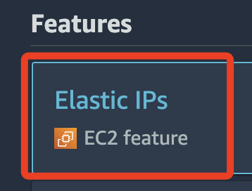
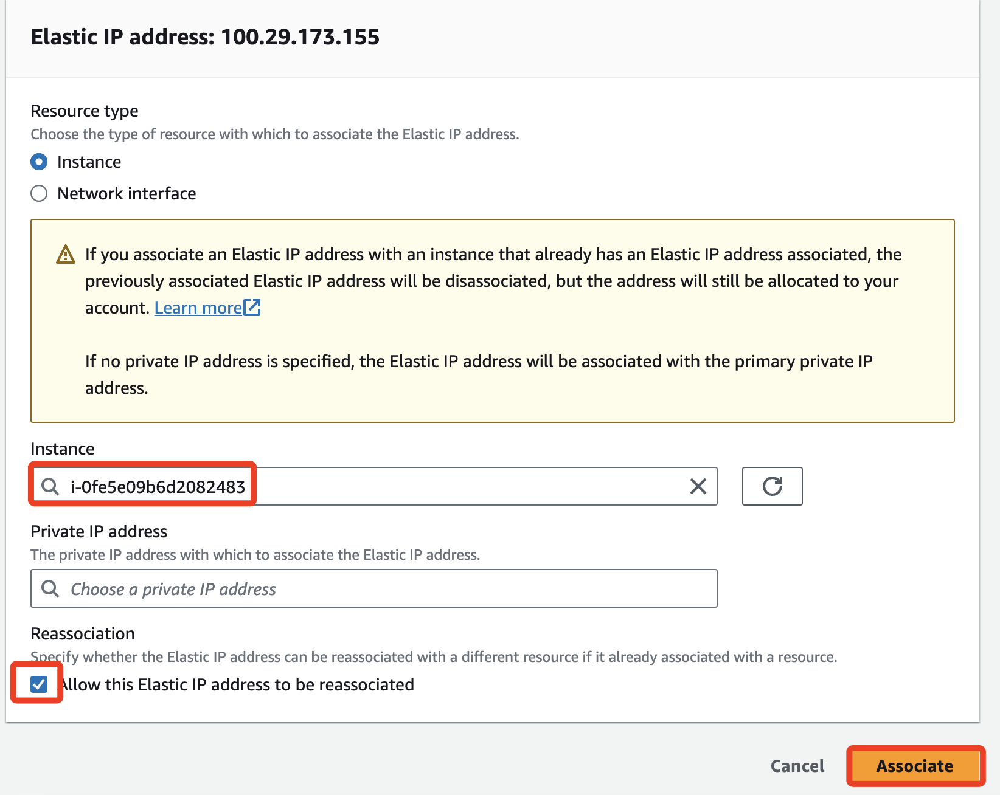
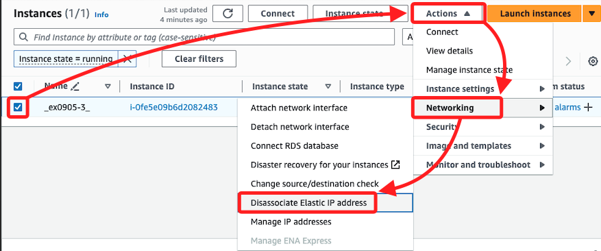
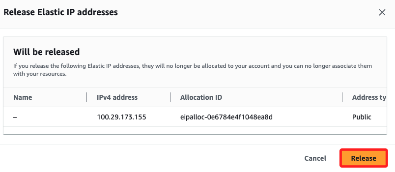

# Elastic IPs

 

## 步驟

1. 搜尋服務 `Elastic IPs`。

    

 

2. 點擊 `Allocate Elastic IP address`。

    

 

3. 皆使用預設即可，點擊 `Allocate`。

    

 

4. 勾選點擊。

    

 

5. 建立關聯。

    

 

## 刪除

_實際稱為釋放 `Release`_

 

1. 先進入 EC2 進行解綁定 `Disassociate Elastic IP addresses`。

    

 

2. 點擊右下角 `Disassociate Elastic IP address`。

    

 

3. 確認。

    

 

4. 在進入 `Elastic IPs` 頁籤中進行釋放 `Release Elastic IP addresses`。

    

 

5. 點擊釋放 `Release`。

    

 

___

_END_