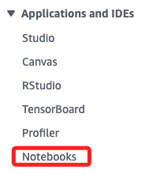
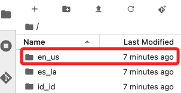

# 人臉識別

_Module 5 – Introducing Computer Vision (CV)，使用 Amazon SageMaker 建立 Jupyter Notebook 實例，以及使用 Amazon Rekognition 進行已知人臉檢測的步驟_

<br>

## 簡介

1. `Amazon SageMaker` 是一個完全托管的 `機器學習` 平台，可快速構建、訓練和部署機器學習模型，以及其他服務和工具來進行數據準備、模型訓練到最終部署的完整機器學習工作流；特別注意，在以下的範例中，並未直接使用到 `SageMaker` 的核心功能，僅使用 `SageMaker Notebook` 建立 Jupyter Notebook 實例，然後在其中調用 Rekognition API 進行操作，而實際的圖片檢測功能是由 `Rekognition` 提供的。

<br>

2. `Amazon Rekognition` 是一個完全托管的計算機視覺服務，使用 `深度學習` 模型來執行圖像和視頻的分析和處理，能夠進行各種圖像處理任務，如人臉檢測與識別、物體和場景檢測、文本檢測、情感分析等；在以下範例中，將使用 `Rekognition` 建立人臉集合，然後將人臉圖像添加到集合中，接著搜索目標圖像中的人臉；專案的最後步驟將對集合中的數據進行刪除。

<br>

## SageMaker

1. 在 Services 搜尋並開啟 Amazon SageMaker。

   

<br>

2. 點擊左側的 Notebooks。

   

<br>

3. 預設會有一個 `MyNotebook` 的 Notebook 實例，點擊末端 `Open JupyterLab` 打開實例。

   

<br>

4. 在左側文件瀏覽器中找到 `en_us` 並點擊進入。

   

<br>

5. 點擊 `05-facedetection.ipynb` 文件。

   

<br>

6. 預設已經選好 `內核（Kernel）` 為 `conda_python3`。

   

<br>

## 雲端運作步驟

1. 建立人臉集合（Collection）：在 Notebook 中運行命令建立一個新的 Amazon Rekognition 人臉集合。

<br>

2. 上傳影像並添加到集合：上傳包含已知人臉的影像，並將其添加到人臉集合中。

<br>

3. 檢測人臉：使用人臉集合來檢測影像中的已知人臉，並查看檢測結果，包括人臉的邊界框（Bounding Box）。

<br>

4. 列出集合中的人臉：查看集合中存儲的所有人臉數據。

<br>

5. 刪除人臉集合：完成操作後，刪除集合以清理實驗環境。

<br>

6. 完成以上步驟後，將可建立一個自定義的 Amazon Rekognition 人臉集合，將影像添加到自定義集合中，在影像中檢測已知的人臉。

<br>

## 若在本地運行

_確認已完成本地 AWS 憑證配置；以下比照 Lab 中的程序分段操作。_

1. 安裝必要的 Python 庫。

   ```bash
   pip install boto3 numpy matplotlib scikit-image Pillow
   ```

<br>

2. 導入庫。

   ```python
   # 影像處理功能
   from skimage import io
   from skimage.transform import rescale
   from matplotlib import pyplot as plt
   # AWS 的 Python SDK
   import boto3
   import numpy as np
   # 影像操作
   from PIL import (
       Image, ImageDraw, ImageColor, ImageOps
   )
   ```

<br>

3. 建立人臉集合。

   ```python
   client = boto3.client('rekognition')
   collection_id = 'Collection'
   response = client.create_collection(
       CollectionId=collection_id
   )
   print('Collection ARN: ' + response['CollectionArn'])
   print('Status Code:' + str(response['StatusCode']))
   print('Done...')
   ```

<br>

4. 上傳人臉圖片。

   ```python
   filename = "image01.jpg"

   # 加載影像
   faceimage = io.imread(filename)
   plt.imshow(faceimage)

   # 確保影像尺寸不超過 4096x4096 像素
   if faceimage.shape[0] > 4096 or faceimage.shape[1] > 4096:
       faceimage = rescale(faceimage, 0.50, mode='constant')
       io.imsave(filename, faceimage)
   ```

<br>

5. 添加圖片到集合。

   ```python
   externalimageid = filename

   with open(filename, 'rb') as fimage:
       response = client.index_faces(
           CollectionId=collection_id,
           Image={'Bytes': fimage.read()},
           ExternalImageId=externalimageid,
           MaxFaces=1,
           QualityFilter="AUTO",
           DetectionAttributes=['ALL']
       )

   print('Results for ' + filename)
   print('Faces indexed:')

   for faceRecord in response['FaceRecords']:
       print('Face ID: ' + faceRecord['Face']['FaceId'])
       print('Location: {}'.format(faceRecord['Face']['BoundingBox']))

   print('Faces not indexed:')

   for unindexedFace in response['UnindexedFaces']:
       print('Location: {}'.format(unindexedFace['FaceDetail']['BoundingBox']))
       print('Reasons:')
       for reason in unindexedFace['Reasons']:
           print('   ' + reason)
   ```

<br>

6. 查看檢測到的人臉邊界框。

   ```python
   img = Image.open(filename)
   imgWidth, imgHeight = img.size

   draw = ImageDraw.Draw(img)
   for faceRecord in response["FaceRecords"]:
       box = faceRecord["Face"]["BoundingBox"]
       left = imgWidth * box["Left"]
       top = imgHeight * box["Top"]
       width = imgWidth * box["Width"]
       height = imgHeight * box["Height"]

       points = (
           (left, top),
           (left + width, top),
           (left + width, top + height),
           (left, top + height),
           (left, top),
       )
       draw.line(points, fill="#00d400", width=5)

   plt.imshow(img)
   ```

<br>

7. 列出集合中的人臉。

   ```python
   maxResults = 2
   faces_count = 0
   tokens = True

   response = client.list_faces(
       CollectionId=collection_id,
       MaxResults=maxResults
   )
   print('Faces in collection ' + collection_id)

   while tokens:
       faces = response['Faces']

       for face in faces:
           print(face)
           faces_count += 1

       if 'NextToken' in response:
           nextToken = response['NextToken']
           response = client.list_faces(
               CollectionId=collection_id,
               NextToken=nextToken,
               MaxResults=maxResults
           )
       else:
           tokens = False
   ```

<br>

8. 使用集合查找人臉。

   ```python
   targetfilename = "image02.jpg"
   targetimage = Image.open(targetfilename)
   plt.imshow(targetimage)

   threshold = 70
   maxFaces = 2

   with open(targetfilename, 'rb') as timage:      
       response2 = client.search_faces_by_image(
           CollectionId=collection_id,
           Image={'Bytes': timage.read()},
           FaceMatchThreshold=threshold,
           MaxFaces=maxFaces)

   faceMatches = response2['FaceMatches']
   print('Matching faces')
   for match in faceMatches:
       print('FaceId:' + match['Face']['FaceId'])
       print('Similarity: ' + "{:.2f}".format(match['Similarity']) + "%")
       print('ExternalImageId: ' + match['Face']['ExternalImageId'])
   ```

<br>

9. 在發現的人臉周圍繪製邊界框。

   ```python
   imgWidth, imgHeight = targetimage.size

   draw = ImageDraw.Draw(targetimage)
   box = response2["SearchedFaceBoundingBox"]
   left = imgWidth * box["Left"]
   top = imgHeight * box["Top"]
   width = imgWidth * box["Width"]
   height = imgHeight * box["Height"]

   points = (
       (left, top),
       (left + width, top),
       (left + width, top + height),
       (left, top + height),
   )
   draw.line(points, fill="#00d400", width=5)

   plt.imshow(targetimage)
   ```

<br>

10. 刪除人臉集合。

    ```python
    print('Attempting to delete collection ' + collection_id)
    status_code = 0
    try:
        response = client.delete_collection(CollectionId=collection_id)
        status_code = response['StatusCode']
        print('All done!')
        print(status_code)

    except boto3.exceptions.Boto3Error as e:
        if e.response['Error']['Code'] == 'ResourceNotFoundException':
            print('The collection ' + collection_id + ' was not found')
        else:
            print('Error other than Not Found occurred: ' + e.response['Error']['Message'])
        status_code = e.response['ResponseMetadata']['HTTPStatusCode']
    ```
