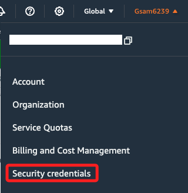
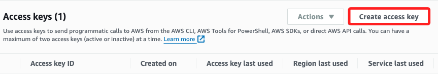
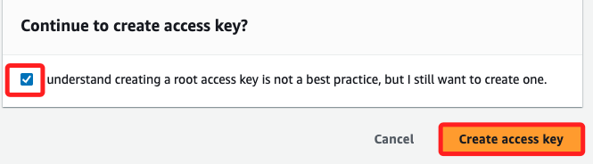
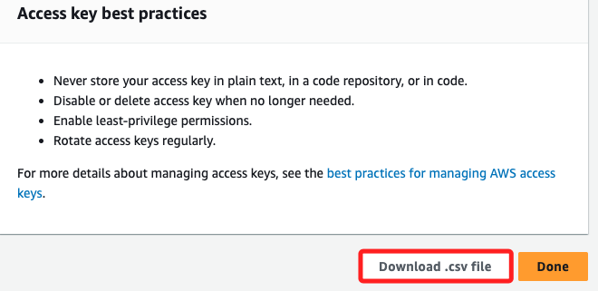
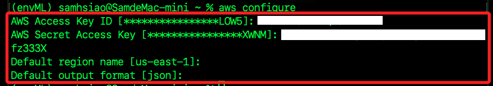

# AWS CLI

<br>

## 安裝工具

_後補_

<br>

## 建立憑證

1. 開啟安全憑證頁面。

    

<br>

2. 建立憑證。

    

<br>

3. 了解並確認。

    

<br>

4. 點擊下載 `.csv` 文件，下載後點擊開啟。

    

<br>

5. 開啟終端機，運行以下指令。

```bash
aws configure
```

<br>

6. 依序輸入 `.csv` 文件中的 `AWS Access Key ID`、`AWS Secret Access Key`，區域預設為 `us-east-1`，`Default output format` 設定為 `json`。

    

<br>

7. 設定檔在本機預設存放位置為 `~/.aws`，內有 `config` 及 `credentials` 兩個設定文件；可使用以下指令進行查看。

    ```bash
    code ~/.aws
    ```

<br>

## 建立本地運行環境

1. 安裝套件。

```bash
pip install boto3
```

<br>

2. 確認安裝版本。

    ```python
    import boto3
    print(boto3.__version__)
    ```

    

<br>

3. 或是透過以下代碼列出 S3 Bucket，這個查詢不會收費。

    ```python
    import boto3
    from botocore.exceptions import NoCredentialsError, PartialCredentialsError

    def check_boto3():
        try:
            # 建立一個 S3 客戶端
            s3 = boto3.client('s3')

            # 列出所有的 S3 Bucket
            response = s3.list_buckets()

            # 輸出Bucket的名稱
            print("S3 Buckets available in your account:")
            for bucket in response['Buckets']:
                print(f"  - {bucket['Name']}")

        except NoCredentialsError:
            print("AWS 憑證未配置。")
        except PartialCredentialsError:
            print("AWS 憑證配置不完整。")
        except Exception as e:
            print(f"發生錯誤: {e}")

    if __name__ == "__main__":
        check_boto3()
    ```

<br>

___

_END_