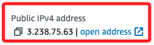

# Sandbox

_`90628`_

<br>

## 說明

1. 點擊進入 `Sandbox Environment`。

    

<br>

2. 參考左邊的步驟進行操作；完成 `Start Lab` 之後，點擊 `AWS` 進入主控台。

    

<br>

3. 搜尋並進入 `Cloud9`。

    

<br>

4. 建立環境。

    

<br>

5. 任意命名如 `_MyEnv-0906_`。

    

<br>

6. 切換 `Network settings` 為 `SSH`。

    

<br>

7. 其餘先使用預設，點擊右下角建立。

    

<br>

8. 會自動跳回清單頁面，等待建立完成。

    

<br>

9. 點擊 `Open` 進入。

    

<br>

10. 關閉歡迎頁面。

    

<br>

## 在 Cloud9 中使用 AWS CLI

_已經內建 CLI，無需額外安裝_

<br>

1. 打開下方終端，執行 AWS CLI 命令；查詢當前用戶身份。

    ```bash
    aws sts get-caller-identity
    ```

    

<br>

2. 列出當前運行的 EC2 實例。

    ```bash
    aws ec2 describe-instances
    ```

<br>

## 使用 AWS SDK for Python

_Boto3_

<br>

1. 開啟新終端。

    

<br>

2. 雖然官方文件語義上似乎說已經安裝了 `boto3`，但實際上並沒有，所以先進行必要的套件安裝。

    ```bash
    pip install boto3
    ```

<br>

3. 訊息指出因為權限問題無法寫入系統的全局 site-packages 目錄，pip 將自動選擇將 Boto3 安裝到使用者目錄，也就是 `user-level installation`，而不是安裝到全局系統目錄。

    

<br>

4. 安裝後可先進入 Python 環境中。

    ```bash
    python3
    ```

<br>

2. 使用 Boto3 操作 EC2。

    ```python
    import boto3
    ec2 = boto3.client('ec2', region_name='us-east-1')
    ec2.describe_regions()
    ```

<br>

3. 列出了 AWS 支持的區域以及 API 請求的相關元數據。

    

<br>

4. 退出 Python。

    ```bash
    exit()
    ```

<br>

## 連接 EC2 實例

_使用密鑰_

<br>

1. 回到 `Academy` 的入口處，展開上方 `Details` 下拉選單，點擊其中的 `Show`。

    

<br>


2. 依據使用的系統以及連線方式下載或複製相關文件或資訊。

    

<br>

3. 假如是下載 PEM 密鑰文件。

    

<br>

4. 這個文件預設是 `644`。

    

<br>

5. 比照 EC2 教程中的說明，先修改密鑰文件的權限為 `400`。

    ```bash
    chmod 400 labsuser.pem
    ```

    

<br>

## EC2

1. 先進入 EC2 查看，建立 Cloud9 的過程中添加了兩個實例。

    

<br>

2. 其中 `Bastion Host` 就是 `跳板主機`，可以通過 `Bastion Host` 來訪問其他位於私有子網中的 EC2 實例。

    

<br>

3. 接著點擊下方的 `Security`，然後點擊 `Security groups`。

    

<br>

4. 在 `Inbound rules` 頁籤中點擊右下方的 `Edit Inbound rules`。

    

<br>

5. 預設已經開啟 `SSH` 的 22 Port，並允許來自所有 IP 的連線 `0.0.0.0`。

    

<br>

6. 在密鑰所在路徑中開啟終端，並直接運行以下指令進行連線；若不在路徑中，則要添加密鑰文件的路徑。

    ```bash
    ssh -i labsuser.pem ec2-user@3.238.75.63
    ```

<br>

7. 第一次連線會詢問是否確認建立連線，輸入 `yes`。

    

<br>

8. 成功連入會顯示如下畫面。

    

<br>

## 結束實驗

1. 完成所有操作後，務必關閉實驗，這會自動刪除所有創建的資源並清理環境。

    

<br>

## 注意事項

1. 所有操作僅限於 `us-east-1` 區域。

<br>

2. EC2 同時運行的實例數量最多為 9 個，超過限制的實例將自動終止。

<br>

3. 在創建 AWS 資源時，使用預設的 `LabRole` 角色

    

<br>

4. 這個角色有預設的 `LabInstanceProfile` 進行訪問和權限控制；`Instance Profile` 是一個容器，用於將 `IAM Role` 連接到 EC2 實例，這樣該實例可以通過角色獲得 AWS 服務的訪問權限。

    

<br>

5. 可查看其中的 `Trust relationships`，這也是 `IAM Role` 的一部分，用於定義哪些實體可以假設這個 Role。

    

<br>

## 其他終端指令

_EC2 相關_

<br>

1. 查詢 Instance Profile 的詳細信息。

    ```bash
    aws iam get-instance-profile --instance-profile-name LabInstanceProfile
    ```

<br>

2. 查詢 IAM 角色 的 Trust Relationships。

    ```bash
    aws iam get-role --role-name LabRole
    ```

<br>

3. 列出當前區域內的所有 EC2 實例。

    ```bash
    aws ec2 describe-instances
    ```

<br>

4. 查看特定 EC2 實例的狀態，這裡以這個 `Bastion Host` 為例。 

    ```bash
    aws ec2 describe-instance-status --instance-ids i-0c3135f2500a4443e
    ```

<br>

5. 查看 EC2 配額。

    ```bash
    aws ec2 describe-account-attributes
    ```

<br>

___

_END_