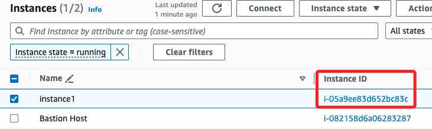
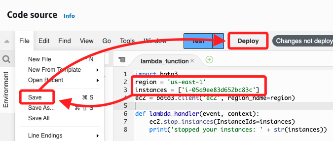
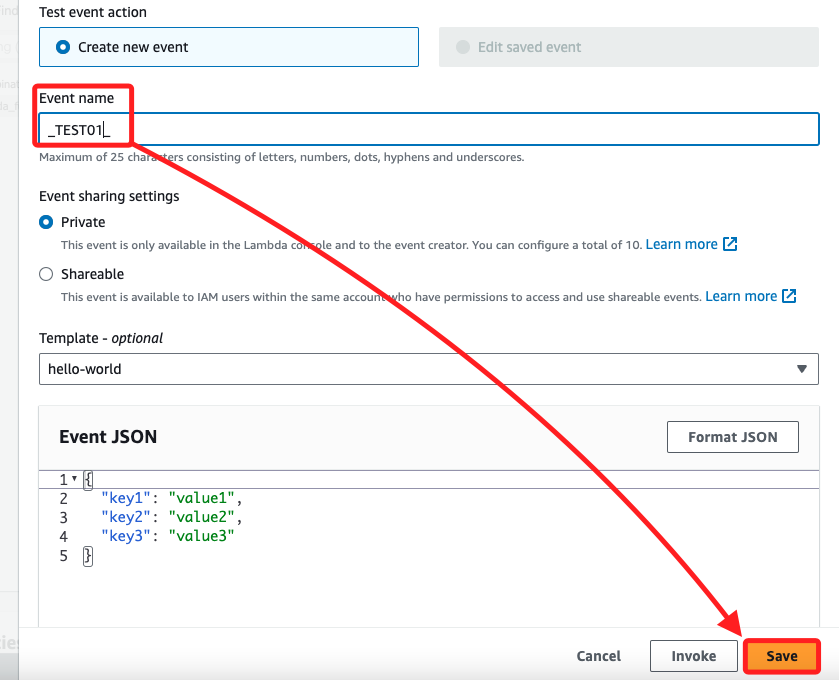
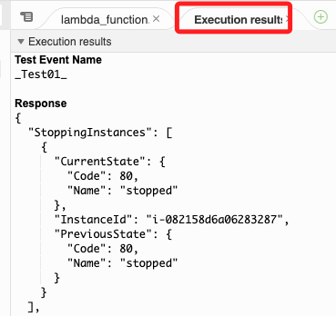
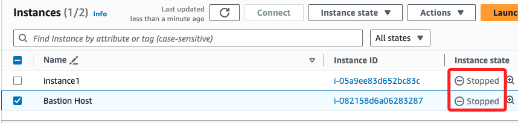

# Lambda

_`90628`，啟動 `Start Lab` 然後進入 `AWS`；建立 Lambda 函數_

<br>

1. 登入 AWS 主控台，搜尋並選擇 `Lambda`。

    

<br>

2. 在 Lambda 首頁，點擊 `Create function`。

    

<br>

3. 在 Create function 畫面中選擇 `Author from scratch`，並任意命名為 `_myStopinator_`，Runtime 選擇 `Python 3.11`，架構使用預設的 `x86_64`。

    

<br>

4. 展開 `Change default execution role`，`Execution role` 選擇 `Use an existing role`，然後從下拉列表中選擇 `myStopinatorRole`；特別注意，這些都是在 Lab 中預先設定好的，然後點擊 `Create function` 創建函數。

    

<br>

5. 畫面如下。

    

<br>

## 配置觸發器

1. 點擊 `+Add trigger`。

    

<br>

2. 在下拉選單中，輸入並選擇 `EventBridge (CloudWatch Events)`。

    

<br>

3. 切換到 `Create a new rule`，任意命名為 `everyMinute`，Rule type 選擇 `Schedule expression`，並手動輸入 `rate(1 minute)`，然後點擊 `Add` 完成觸發器的新增。

    

<br>


## 編輯 Lambda 代碼

_以下範例將展示停止運行中 `running` 的 `EC2` 實例_

<br>

1. 切換到 `Code` 頁籤，確認當前開啟的腳本是 `lambda_function.py`，接著要編輯代碼。

    

<br>

2. 前往 EC2 主控台複製所要控制的實例 `Instance 1` 的 ID；這是 Lab 對這個操作提供的實例。

    

<br>

3. 編輯代碼區塊，將原本的代碼清除然後貼上以下代碼，並且填入查詢所得的區域與EC2 實例 ID。

    ```python
    import boto3
    # 填入自己的區域及實例 ID
    region = 'us-east-1'
    instances = ['<填入要停用的實例ID>']
    ec2 = boto3.client('ec2', region_name=region)

    def lambda_handler(event, context):
        try:
            response = ec2.stop_instances(InstanceIds=instances)
            print('停止實例：' + str(instances))
            return response
        except ClientError as e:
            print(f"無法停止實例：{e}")
            raise e
    ```

<br>

6. 展開 `File` 可儲存 `Save` 腳本，然後部署代碼 `Deploy`。

    

<br>

7. 完成佈署便可點擊 `Test` 建立測試事件；任意命名如 `_TEST01_`，然後點擊儲存 `Save`。

    

<br>

8. 然後會輸出執行結果頁籤；建立後，代碼若未變更，可直接再次點擊測試運行代碼。

    

<br>

9. 前往 EC2 控制台，檢查指定的 EC2 實例是否被停止。

    

<br>

## 提交結果

1. 當所有任務完成後，點擊教程頁面頂部的 Submit 按鈕提交結果，系統會根據完成的進度自動給予評分。  

<br>

2. 點擊 `End Lab` 結束 `Lab`。

<br>

___

_END_