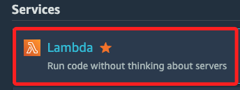
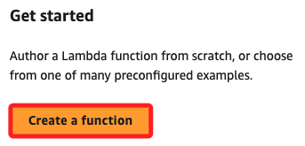
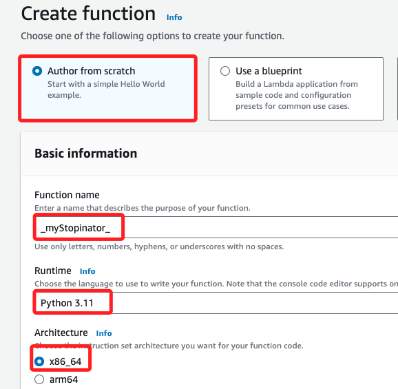
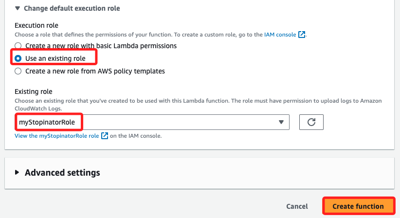
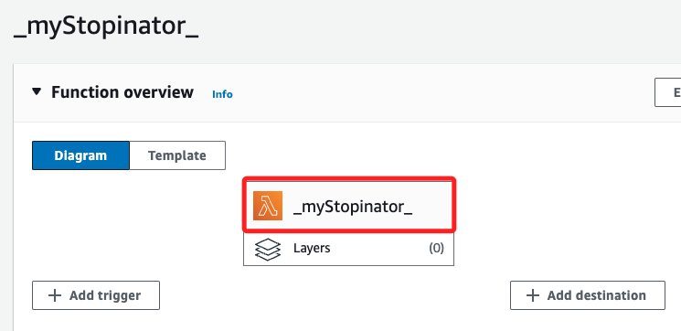
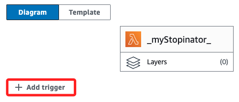
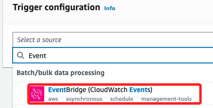
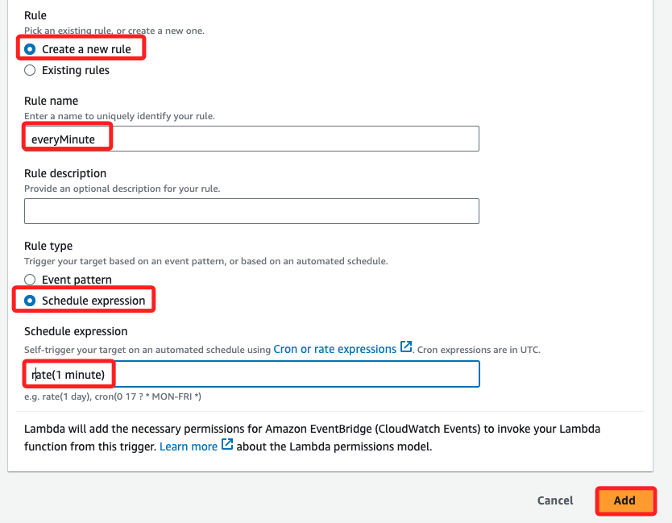
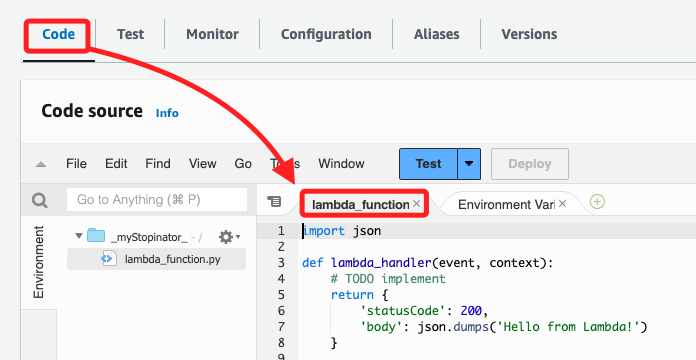

# Lambda 

## 主題：自動停止 EC2 實例的 Lambda 函數建立與觸發

_`90628`，啟動 `Start Lab` 然後進入 `AWS`_

1. 登入 AWS 主控台，搜尋並選擇 `Lambda`。



2. 在 Lambda 首頁，點擊 `Create function`。



3. 在 Create function 畫面中選擇 `Author from scratch`，並任意命名為 `_myStopinator_`，Runtime 選擇 `Python 3.11`，架構使用預設的 `x86_64`。



4. 展開 `Change default execution role`，`Execution role` 選擇 `Use an existing role`，然後從下拉列表中選擇 `myStopinatorRole`；特別注意，這些都是在 Lab 中預先設定好的，然後點擊 `Create function` 創建函數。



5. 畫面如下。



## 配置觸發器

1. 點擊 `+Add trigger`。



2. 在下拉菜單中，輸入病選擇 `EventBridge (CloudWatch Events)`。



3. 切換到 `Create a new rule`，任意命名為 `everyMinute`，Rule type 選擇 `Schedule expression`，並手動輸入 `rate(1 minute)`，然後點擊 `Add` 完成觸發器的新增。




## 編輯 Lambda 代碼

1. 切換到 `Code` 頁籤，確認當前開啟的腳本是 `lambda_function.py`，接著要編輯代碼。



2. 刪除預設代碼，並貼上以下代碼，分別修改區域、EC2 實例 ID。

```python
import boto3
region = '<REPLACE_WITH_REGION>'
instances = ['<REPLACE_WITH_INSTANCE_ID>']
ec2 = boto3.client('ec2', region_name=region)

def lambda_handler(event, context):
ec2.stop_instances(InstanceIds=instances)
print('stopped your instances: ' + str(instances))
```
   
1. 保存並部署代碼
   - 點擊 File 菜單並選擇 Save 保存更改，然後點擊 Deploy 來部署代碼。

---

### 步驟 4：驗證 Lambda 函數的工作狀態

1. 檢查 Lambda 函數是否運行成功  
   - 返回 Amazon EC2 控制台，檢查指定的 EC2 實例是否被停止。可以通過點擊 刷新圖示 或重新加載頁面來更新實例的狀態。

2. 監控 Lambda 函數的執行情況  
   - 返回 Lambda 控制台，點擊 Monitor 標籤，你可以看到 Lambda 函數的執行次數以及成功率和錯誤率的百分比。

---

### 步驟 5：提交實驗結果

1. 提交實驗  
   - 當所有任務完成後，點擊教程頁面頂部的 Submit 按鈕提交結果。
   - 系統會根據你完成的進度自動給予評分。  
   - 你可以多次提交，並在每次提交後查看具體的分數與反饋。

2. 結束 Lab  
   - 當完成所有任務後，點擊 End Lab 結束實驗，並選擇 Yes 確認結束。

---

### 總結：
此教程的目的是讓你創建一個 Lambda 函數，並通過 Amazon EventBridge 事件來自動觸發該函數。你將學習如何使用 Lambda 函數來自動停止 EC2 實例，並通過事件調度器每分鐘觸發函數。這樣的操作可以應用在節省成本和自動化資源管理上。

這份指南分步描述了如何在 AWS 主控台中創建和配置 Lambda 函數、觸發器以及如何使用 EventBridge 來進行自動調度。