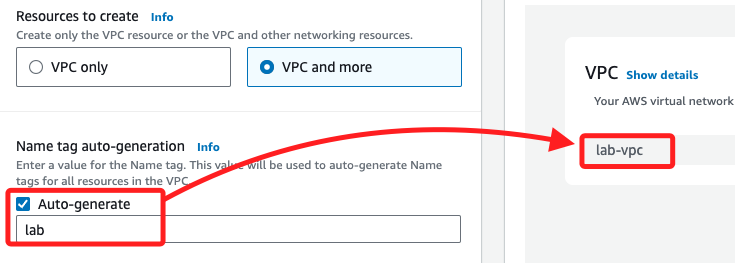

# VPC

<br>

## 建立 VPC

1. 搜尋並進入服務 VPC；進入後確認所在區域為 `N. Virginia (us-east-1)`。

    

<br>

2. 觀察一下當前的 VPCs，有兩個。

    

<br>

3. 點擊 `Create VPC`。

    

<br>

4. 選擇 `VPC and more`。

    

<br>

5. 右側有預覽的樹狀圖。

    

<br>

6. 勾選名稱自動生成 `Auto-generate`，命名為 `lab`；注意，右側預覽畫面中的名稱 `project-vpc` 也會更改為 `lab-vpc`。

    

<br>

## 進行設定

1. 選擇 `1` 個可用區 `AZs`。

    

<br>

2. 公共子網 CIDR 設置為 `10.0.0.0/24`，私有子網 CIDR 設置為 `10.0.1.0/24`。

    

<br>

3. NAT 閘道設為 `1` 個可用區。

    

<br>

4. `VPC endpoints` 設置為 `None`。

    

<br>

## 預覽並檢查

_名稱如前說明已自動變更為 `lab-vpc`_

<br>

1. Subnets (2)。

    

<br>

2. Route tables (2)。

    

<br>

3. Network connections (2)。

    

<br>

4.  確認設定並選擇 `Create VPC`。

    

<br>

5. 過程還蠻耗時的。

    

<br>

6. 完成後點擊 `View VPC` 進行檢視。

    

<br>

## 建立其他子網

1. 在左側導航欄選擇 `Subnets`。

    

<br>

2. 建立第二個公共子網 `Cretae subnet`。

    

<br>

3. 選擇剛剛建立的 `lab-vpc`。

    

<br>

4. 子網名稱 `lab-subnet-public2`、可用區 `us-east-1b`、IPv4 CIDR：`10.0.2.0/24`。

    

<br>

5.  再建立第二個私有子網，名稱 `lab-subnet-private2`、可用區 `us-east-1b`、IPv4 CIDR：`10.0.3.0/24`。

<br>

## 更新路由表

1. 選擇 Route tables。
- 編輯 `lab-rtb-private1-us-east-1a` 路由表，將新建的私有子網 (`lab-subnet-private2`) 與此路由表關聯。
- 編輯 `lab-rtb-public` 路由表，將新建的公共子網 (`lab-subnet-public2`) 與此路由表關聯。

#### 5. 建立安全群組
- 在左側導航欄選擇 Security groups。
- 建立一個新的安全群組：
  - 名稱：`Web Security Group`。
  - 描述：`Enable HTTP access`。
  - VPC：選擇 `lab-vpc`。
- 添加入站規則：
  - 類型：HTTP。
  - 來源：Anywhere-IPv4。
  - 描述：`Permit web requests`。

#### 6. 啟動 Web 伺服器
- 搜尋並選擇 EC2，點擊 Launch instance。
- 命名實例：`Web Server 1`。
- 選擇 Amazon Linux 2023 AMI。
- 保留 `t2.micro` 實例類型。
- 選擇密鑰對：`vockey`。
- 網路設置：
  - 選擇 `lab-vpc`。
  - 子網：`lab-subnet-public2`。
  - 啟用自動分配公共 IP。
- 防火牆：選擇 `Web Security Group`。
- 展開高級設置，將以下腳本粘貼至 User data：
  ```bash
  #!/bin/bash
  dnf install -y httpd wget php mariadb105-server
  wget https://aws-tc-largeobjects.s3.us-west-2.amazonaws.com/CUR-TF-100-ACCLFO-2/2-lab2-vpc/s3/lab-app.zip
  unzip lab-app.zip -d /var/www/html/
  chkconfig httpd on
  service httpd start
  ```
- 點擊 Launch instance，等待實例啟動。

#### 7. 連接 Web 伺服器
- 待實例狀態顯示 2/2 checks passed。
- 複製 Public IPv4 DNS，在新瀏覽器頁面中打開並查看網頁。

#### 8. 提交 Lab
- 點擊 Submit 並確認進度，查看成績。

#### 9. 結束 Lab
- 選擇 End Lab 並確認結束實驗。

### 結論：
你已成功建立一個 VPC，並在其中配置了公共和私有子網、安全群組，以及啟動了一個 Web 伺服器。