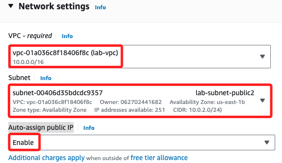

# VPC

<br>

## 建立 VPC

1. 搜尋並進入服務 VPC；進入後確認所在區域為 `N. Virginia (us-east-1)`。

    

<br>

2. 觀察一下當前的 VPCs，有兩個。

    

<br>

3. 點擊 `Create VPC`。

    

<br>

4. 選擇 `VPC and more`。

    

<br>

5. 右側有預覽的樹狀圖。

    

<br>

6. 勾選名稱自動生成 `Auto-generate`，命名為 `lab`；注意，右側預覽畫面中的名稱 `project-vpc` 也會更改為 `lab-vpc`。

    

<br>

## 進行設定

1. 選擇 `1` 個可用區 `AZs`。

    

<br>

2. 公共子網 CIDR 設置為 `10.0.0.0/24`，私有子網 CIDR 設置為 `10.0.1.0/24`。

    

<br>

3. NAT 閘道設為 `1` 個可用區。

    

<br>

4. `VPC endpoints` 設置為 `None`。

    

<br>

## 預覽並檢查

_名稱如前說明已自動變更為 `lab-vpc`_

<br>

1. Subnets (2)。

    

<br>

2. Route tables (2)。

    

<br>

3. Network connections (2)。

    

<br>

4.  確認設定並選擇 `Create VPC`。

    

<br>

5. 過程還蠻耗時的。

    

<br>

6. 完成後點擊 `View VPC` 進行檢視。

    

<br>

## 說明 IPv4 CIDR

1. 從 Details 視窗中可以看到建立的 `IPv4 CIDR` 是 `10.0.0.0/16`；這是 VPC 的 CIDR，代表 VPC 可以擁有從 `10.0.0.0` 到 `10.0.255.255` 的 IP 地址範圍。

    

<br>

2. 而子網是在 VPC 內劃分的小網路範圍，前面設定了 `10.0.0.0/24` 和 `10.0.1.0/24` 兩個子網的範圍，它們分別位於 VPC 的 `10.0.0.0/16` 之下，子網共享 VPC 的大範圍，但自身有各自的更小的 IP 範圍；可分別點擊並展開預覽圖中的子網來觀察這個範圍。

    

<br>

## 建立其他子網

_當前有公共、私有子網各有一個_

<br>

1. 在左側欄選擇 `Subnets`。

    

<br>

2. 建立第二個公共子網 `Cretae subnet`。

    

<br>

3. 選擇剛剛建立的 `lab-vpc`。

    

<br>

4. 子網名稱 `lab-subnet-public2`、可用區選 `us-east-1b`；`IPv4 subnet CIDR block` 需要手動輸入為 `10.0.2.0/24`。

    

<br>

5. 完成後點擊右下角 `Create subnet`。

    

<br>

6. 接著，建立第二個私有子網，名稱 `lab-subnet-private2`、可用區 `us-east-1b`、IPv4 CIDR：`10.0.3.0/24`；完成同樣點擊 `Create subnet`，會顯示在清單的最下方。

    

<br>

## 更新路由表

1. 點擊左側的 `Route tables`，然後點擊 `刷新`，就會看到新增的路由表。

    

<br>

2. 勾選 `lab-rtb-private1-us-east-1a` 路由表，展開 `Actions`，點擊其中的 `Edit subnet associations`。

    

<br>

3. 勾選新建的私有子網 (`lab-subnet-private2`) ，點擊右下角 `Save associations` 便可建立與此路由表的關聯。

    

<br>

4. 完成後會顯示 `2 subnets`。

    

<br>

5. 比照之前步驟，接著對 `lab-rtb-public` 路由表編輯子網關聯，將新建的公共子網 (`lab-subnet-public2`) 與此路由表關聯。

    

<br>

## 建立安全群組

1. 在左側欄選擇 `Security groups`。

    

<br>

2. 建立新的安全群組。

    

<br>

3. 名稱為 `Web Security Group`、描述 `Enable HTTP access`、VPC `lab-vpc`。

    

<br>

4. 添加入站規則 `Inbound rules`。

    

<br>

5. 類型 `HTTP`、來源 `Anywhere-IPv4`、描述 `Permit web requests`。

    

<br>

6. 點擊右下角 `Create secyrity group`。

    

<br>

## 啟動 Web 伺服器

1. 搜尋並進入 EC2 主控台，點擊 `Launch instance`；命名 `Web Server 1`，密鑰對選擇 `vockey`；接著點擊網路設置 `Network settings` 右側的 `Edit`。

    

<br>

2. 選擇 `lab-vpc`、子網選擇 `lab-subnet-public2`、自動分配公共 IP `Auto-assign public IP` 設定為 `Enable`。

    

<br>

3. 防火牆 `Firewall` 選擇 `Web Security Group`。

    

<br>

4. 展開最下方的 `Advanced details`，將以下代碼貼到 `User data` 欄位中。

    ```bash
    #!/bin/bash
    dnf install -y httpd wget php mariadb105-server
    wget https://aws-tc-largeobjects.s3.us-west-2.amazonaws.com/CUR-TF-100-ACCLFO-2/2-lab2-vpc/s3/lab-app.zip
    unzip lab-app.zip -d /var/www/html/
    chkconfig httpd on
    service httpd start
    ```

<br>

5. 以上是個一般的 Bash 腳本，所以不需要勾選 `User data has already been base64 encoded`，AWS 會自動將該腳本進行 Base64 編碼並傳遞給 EC2 實例；點擊 `Launch instance` 啟動。

    

<br>

## 連接 Web 伺服器

1. 實例狀態顯示 `Success` 之後，複製 `Public IPv4 address` 在瀏覽器查看網頁。

    

<br>

## 完成

1. `Submit` & `End Lab`。

<br>

___

_END_