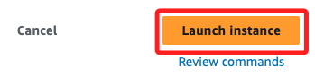
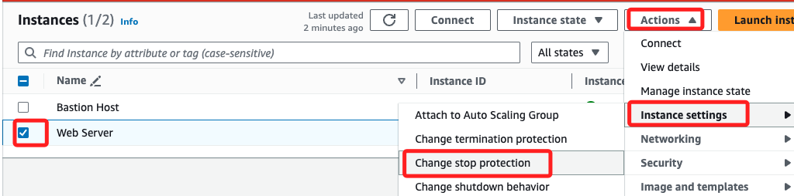

# EC2

_Lab 3: Introduction to Amazon EC2，啟動、管理、監控、調整 Amazon EC2 實例_

<br>

##  啟動 Amazon EC2 實例

1. 進入 EC2 服務，確認區域為 `N. Virginia (us-east-1)`，點擊 `Launch instance`。

<br>

2. 實例命名為 `Web Server`，`Key pair` 選擇 `vockey`。

<br>

3. 在 `Network settings` 點擊 `Edit` 展開，選用 `Lab VPC`，這是一個包含兩個公共子網的 VPC。

    

<br>

4. 在 `Firewall (security groups)` 部分選擇 `Create security group` 建立安全組，命名為 `Web Server security group`。

    

<br>

5. 點擊 `Remove` 移除預設的入站規則 `Inbound Security Group Rules`。

    

<br>

## `Advanced details ` 進階設置

1. 啟用終止保護和停止保護。

    

<br>

2. 在 `User Data` 輸入以下指令腳本；這個腳本在啟動實例後，可將使用者資料傳遞給實例，而這些資料會在實例啟動後執行自動化安裝和設定任務，包含了安裝 Apache Web 伺服器 (httpd)、將 Web 伺服器設定為開機自動啟動、安裝完成後執行 Web 伺服器、建立一個簡單的網頁。

    ```bash
    #!/bin/bash
    dnf install -y httpd
    systemctl enable httpd
    systemctl start httpd
    echo '<html><h1>Hello From Your Web Server!</h1></html>' > /var/www/html/index.html
    ```

<br>

3. 完成後，選擇 `Launch instance`。

    

<br>

## 監控 EC2 實例

1. 進入 `Status and alarms` 頁籤可以查看 `Status checks`。

    

<br>

2. `Monitoring` 頁籤會顯示多項執行個體的 CloudWatch 指標。

    

<br>

3. 進入實例後，可展開 `Actions` 點擊 `Monitor and troubleshoot`，在 `Get system log` 查看系統日誌。

    

<br>

4. 另外，可以透過 `Get instance screenshot` 取得終端機的快照，藉此在不使用 SSH 連線的情況下，迅速取得實例狀態。

    

<br>

## 更新安全組並存取 Web 伺服器

1. 修改安全組 `Web Server security group`， 添加入站規則。

    

<br>

2. 允許來自任何地方的 `HTTP` 流量。

    

<br>

3. 複製實例的 `Public IPv4 address` 進行訪問。

    

<br>

## 調整實例與 EBS 卷

1. 停止實例 `Stop instance`。

<br>

2. 更改實例類型為 `t2.small`。

    

<br>

3. 確認。

    

<br>

4. 停止保護。

    

<br>

5. 儲存。

    

<br>

## 調整 EBS 存儲卷

1. 切換到 `Stirage` 頁籤，點擊 `Volumn ID` 進入 Volumn。

    

<br>

2. 勾選並點擊 `Actions` 後選取 `Modify volumn`。

    

<br>

3. 增加 EBS 卷的大小到 10 GiB。

    

<br>

4. 刷新後查看。

    

<br>

5. 重新啟動實例。

<br>

## 探索 EC2 限制

1. 進入 `Service Quotas`，檢查 EC2 資源的使用配額。

    

<br>

2. 選取進入。

    

<br>

3. 可搜尋 `running on-demand` 查看。

    

<br>

## 嘗試停止實例

1. 嘗試停用，但是之前已經啟用了停止保護，所以會出錯。

    

<br>

2. 重新設定。

    

<br>

3. 取消勾選。

    

<br>

4. 再次嘗試停用。

    

<br>

5. 完成。

    

<br>

## 完成

_`Submit` && `End Lab`_

<br>

___

_END_
