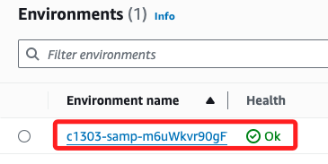
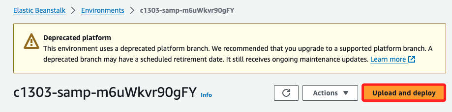
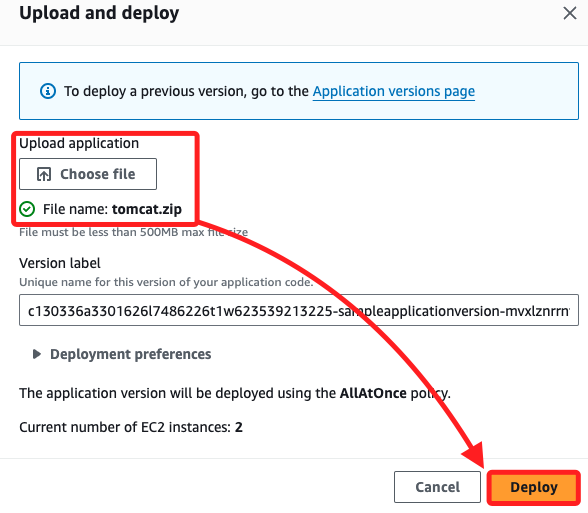
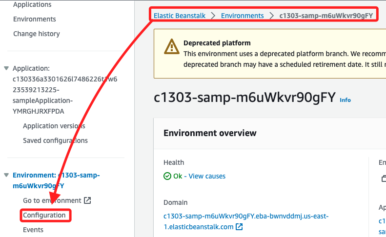

# Elastic Beanstalk

_此 Lab 提供一個預設的 AWS Elastic Beanstalk 環境，任務是部署代碼到該環境並觀察 Elastic Beanstalk 自動創建的 AWS 資源_

 

## 環境確認

1. 進入服務 `Elastic Beanstalk`，確認狀態為 `Ok`。

    

 

2. 點擊域名連結。

    

 

3. 顯示 HTTP 404 錯誤，表示尚無應用程式在運行。

    

 

## 部署應用

1.  下載官方範例文件 [tomcat.zip](https://docs.aws.amazon.com/elasticbeanstalk/latest/dg/samples/tomcat.zip) 到本地資料夾。

    

 

2. 在 Elastic Beanstalk 控制台中展開選單，點擊 `Enviroments`，然後點擊右側的 `Enviroment name` 項目下的實例。

    

 

3. 點擊 `Upload and Deploy`。

    

 

4. 上傳下載的 `tomcat.zip` 檔案並部署。

    

 

5. 完成部署後，刷新域名網頁便看到部署的範例應用程式。

    

 

## 查看資源

1. 在控制台中，選擇 `Configuration`  可查看實例流量、擴展、EC2 安全組等設置；也可以為應用程式環境添加資料庫。

    

 

2. 前往 EC2 控制台，可查看由 Elastic Beanstalk 建立的實例。

    

 

3. 可以進一步探索負載均衡器和自動擴展組等資源。

_後補_

## 完成

_Submit && End Lab_

 

___

_END_