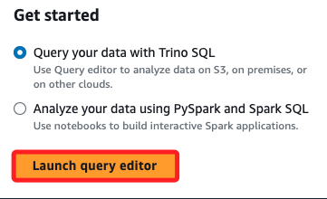
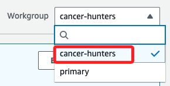
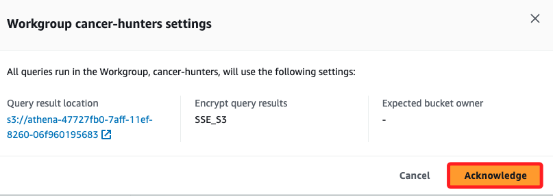
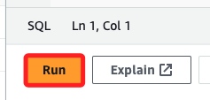
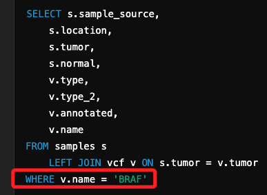
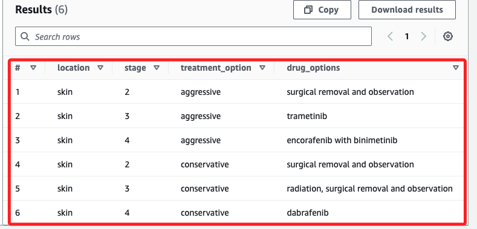

# Cancer Hunters Lab


<br>

## 操作步驟

_在此 [Lab](https://awseducate.instructure.com/courses/990/modules) 中會使用 Amazon Athena 和 SQL 來分析癌症數據，目標是協助四位癌症研究者及醫生解決與癌症基因突變相關的問題，後續會有幾個 `Data Scientist Scenarios`。_

<br>

## 目標

1. 使用 Athena SQL 探索多個癌症細胞數據集。

<br>

2. 找出癌症細胞突變的類型。

<br>

3. 分析 DNA 序列中的錯誤。

<br>

4. 根據臨床 DNA 突變數據討論針對癌症的治療方法。

<br>

## 開啟 Amazon Athena

1. 在控制台搜尋 `Athena`。

   

<br>

2. 點擊 `Launch query editor` 啟動查詢編輯器。

   

<br>

3. 在畫面右側 `Workgroup` 選單中選擇 `cancer-hunters` 工作群組；在 Athena 中，工作群組是用來管理和控制查詢執行環境的工具，允許用戶對查詢資源、行為、成本進行分組管理；選擇適當的工作群組可以確保使用正確的資源配置和策略來運行查詢。

   

<br>

4. 並在彈出的對話框中選擇 `Acknowledge`。

   

<br>

## Scenario 1: Dr. Wei 和 TP53 突變

_問題：Dr. Wei 想知道其腫瘤診所中女性癌症 `患者（sample_source）` 的分佈，並搜尋是否有 TP53 突變的樣本。_

<br>

1. 切換頁籤到 `Saved queries`，打開已保存的查詢；`Saved Queries` 是 Athena 中的一項功能，允許保存並重複使用經常運行的查詢，對於簡化數據查詢、促進團隊協作以及提高效率具有很大的幫助，尤其是在進行定期數據分析或執行範例 Lab 時非常實用。

   

<br>

2. 從列表中找到名稱為 `1 - All female samples` 的查詢，點擊 ID 列中的鏈接，這是 `全部女性樣本` 的數據；特別注意，這是無序的資料。

   

<br>

3. 其中已經預設了查詢語法；這就是 SQL 語法，很容易理解就是查看全部女性樣本。

   ```sql
   SELECT * FROM samples WHERE sex = 'female'
   ```

<br>

4. 點擊 `Run` 執行，結果會顯示女性患者的樣本結果。

   

<br>

5. 依據教程指示，要 `記下以下問題的答案：癌症樣本來自哪些部位？例如，腎臟、骨髓、肺或胰腺`，有可以選擇 `下載結果（Download results）`。

   

<br>

6. 再次切換頁籤到 `Saved queries`，選擇名稱為 `2 - Female TP53 samples` 的查詢，並點擊運行 `Run`。

   

<br>

7. 根據結果，寫下 TP53 突變 導致的女性癌症類型。

   

<br>

8. 這部分的結論是通過數據查詢，確定女性患者的癌症分佈與 TP53 突變相關的癌症類型，幫助 Dr. Wei 進行進一步的癌症研究與診斷。

<br>

## Scenario 2: Dr. Salazar 和 BRAF 突變

_問題：Dr. Salazar 想知道 BRAF 突變是否與數據中的癌症相關，並尋求對三位病人的治療建議。_

<br>

1. 選擇 `Saved queries`，找到名稱為 `3 - VCF and samples joined` 的查詢並打開

   

<br>

2. 在最後面添加條件。

      ```sql
      WHERE name = 'BRAF'
      ```

      

<br>

3. 運行查詢，記下以下問題的答案：數據集中有哪些癌症類型與 BRAF 突變相關？

   

<br>

4. 使用圈選方式，輸入以下語法後，先圈選再查詢。

   ```sql
   select * from treatments where location = 'skin'
   ```

<br>

5. 也可以點擊 `+` 號建立一個新查詢，同樣輸入前面的 SQL 查詢，便可搜尋皮膚癌的治療方案。

   

<br>

6. 結果顯示。

   

<br>

7. 第一個結果顯示 `不同病人的樣本來源`、`癌症位置`、`突變類型` 以及 `基因的註釋狀況`，這表明患者患有特定的基因突變，特別是 `BRAF 突變`，該突變與 `黑色素瘤` 密切相關；第二個結果顯示 `病人對應的治療選項`、`癌症的階段（stage）`，以及 `具體的藥物選擇`。根據這些結果，可為三位病人（F、S 和 U）提供具體的治療建議；這裡主要是 AWS 的操作，推論部分先略過。

<br>

## Scenario 3: Dr. Santos 的腎癌研究

_問題：Dr. Santos 想知道腎癌患者的非註釋型替換突變，並尋求治療方案。_

<br>

1. 選擇 `Saved queries`，找到名稱為 `4 - All kidney samples` 的查詢並 `運行`。

<br>

2. 再次選擇 `Saved queries`，選擇名稱為 `5 - Calculate kidney VCF` 的查詢，並添加以下條件。

   ```sql
   WHERE location = 'kidney' AND type_2 = 'substitution'
   ```

<br>

3. 再次 `運行`，並添加條件 `排除已註釋的樣本`。

   ```sql
   AND annotated = 'no'
   ```

<br>

4. 根據結果，記下哪些患者有腎癌且存在非註釋型替換突變。

<br>

5. 建立新查詢，輸入以下 SQL 查詢以搜尋腎癌的治療方案。

   ```sql
   select * from treatments where location = 'kidney'
   ```

<br>

6. 根據結果，為 `Patient J` 和 `Patient P` 提供治療建議；Patient J 需要保守治療（早期第二期）、Patient P 需要更激進的治療（第四期）。

<br>

## Scenario 4: Dr. Owusu 和肺癌患者

_問題：Dr. Owusu 想了解其肺癌患者的性別比例以及哪些患者有 KRAS 突變。_

<br>

1. 建立新查詢，輸入以下 SQL 查詢以搜尋所有肺癌樣本。

   ```sql
   select * from samples where location = 'lung'
   ```

<br>

2. 運行查詢，寫下肺癌患者的性別比例（男對女）。

<br>

3. 再次選擇 `Saved queries`，選擇 `3 - VCF and samples joined` 的查詢，並修改條件。

   ```sql
   WHERE name = 'KRAS' and location = 'lung'
   ```

<br>

4. 運行查詢，寫下有哪些肺癌患者有 KRAS 突變。

<br>

___

_END_