# Cancer Hunters Lab

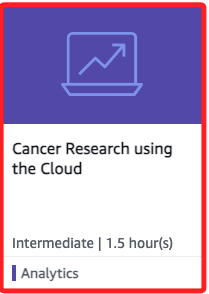

<br>

## 操作步驟

_在此 [Lab](https://awseducate.instructure.com/courses/990/modules) 中會使用 Amazon Athena 和 SQL 來分析癌症數據，目標是協助四位癌症研究者及醫生解決與癌症基因突變相關的問題，後續會有幾個 `Data Scientist Scenarios`。_

<br>

## 目標

1. 使用 Athena SQL 探索多個癌症細胞數據集。

<br>

2. 找出癌症細胞突變的類型。

<br>

3. 分析 DNA 序列中的錯誤。

<br>

4. 根據臨床 DNA 突變數據討論針對癌症的治療方法。

<br>

## 開啟 Amazon Athena

1. 在控制台搜索 `Athena`。

   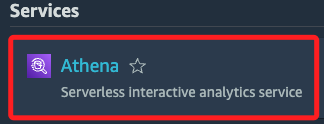

<br>

2. 點擊 `Launch query editor` 啟動查詢編輯器。

   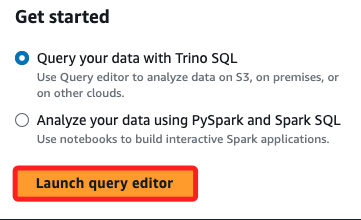

<br>

3. 在畫面右側 `Workgroup` 選單中選擇 `cancer-hunters` 工作群組。

   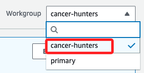

<br>

4. 並在彈出的對話框中選擇 `Acknowledge`。

   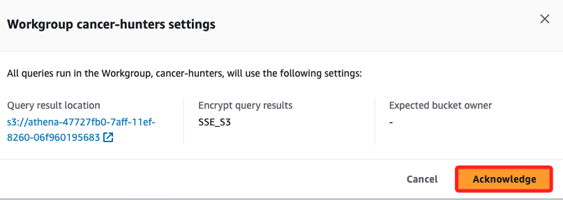

<br>

## Scenario 1: Dr. Wei 和 TP53 突變

_問題：Dr. Wei 想知道其腫瘤診所中女性癌症 `患者（sample_source）` 的分佈，並查找是否有 TP53 突變的樣本。_

<br>

1. 切換頁籤到 `Saved queries`，打開已保存的查詢。

   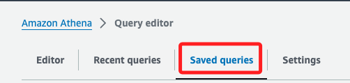

<br>

2. 從列表中找到名稱為 `1 - All female samples` 的查詢，點擊 ID 列中的鏈接。

   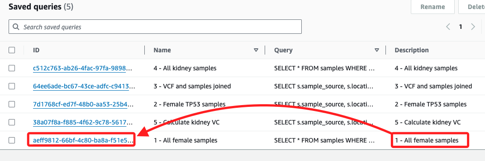

<br>

3. 其中已經預設了查詢語法。

   ```sql
   SELECT * FROM samples WHERE sex = 'female'
   ```

<br>

4. 選擇 `Run`，查看女性患者的樣本結果。

   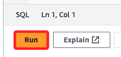

<br>

5. 依據教程指示，要 `記下以下問題的答案：癌症樣本來自哪些部位？例如，腎臟、骨髓、肺或胰腺`，在這裡我選擇 `下載結果`。

   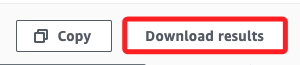

<br>

6. 再次切換頁籤到 `Saved queries`，選擇名稱為 `2 - Female TP53 samples` 的查詢，並運行 `Run`。

   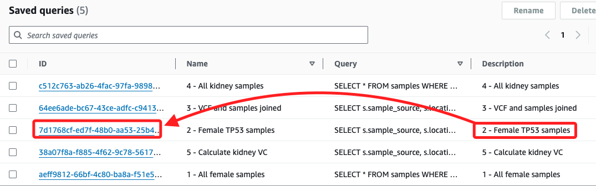

<br>

7. 根據結果，寫下 TP53 突變 導致的女性癌症類型。

   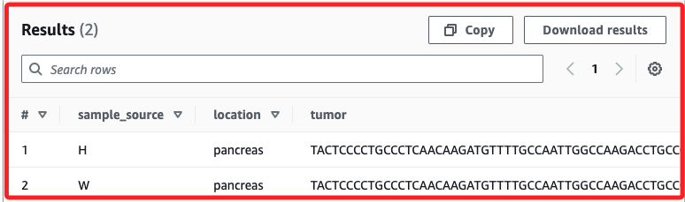

<br>

8. 這部分的結論是通過數據查詢，確定女性患者的癌症分佈與 TP53 突變相關的癌症類型，幫助 Dr. Wei 進行進一步的癌症研究與診斷。

<br>

## Scenario 2: Dr. Salazar 和 BRAF 突變

_問題：Dr. Salazar 想知道 BRAF 突變是否與數據中的癌症相關，並尋求對三位病人的治療建議。_

<br>

1. 選擇 `Saved queries`，找到名稱為 `3 - VCF and samples joined` 的查詢並打開

   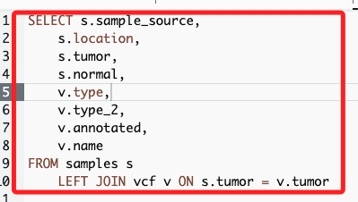

<br>

2. 在最後面添加條件。

      ```sql
      WHERE name = 'BRAF'
      ```

      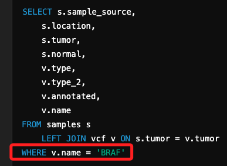

<br>

3. 運行查詢，記下以下問題的答案：數據集中有哪些癌症類型與 BRAF 突變相關？

   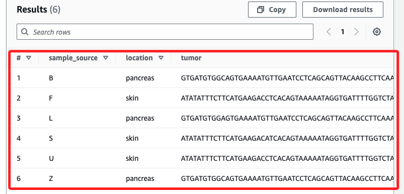

<br>

4. 使用圈選方式，輸入以下語法後，先圈選再查詢。

   ```sql
   select * from treatments where location = 'skin'
   ```

<br>

5. 也可以點擊 `+` 號建立一個新查詢，同樣輸入前面的 SQL 查詢，便可查找皮膚癌的治療方案。

   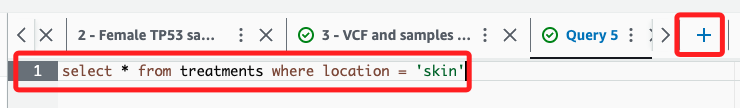

<br>

6. 結果顯示。

   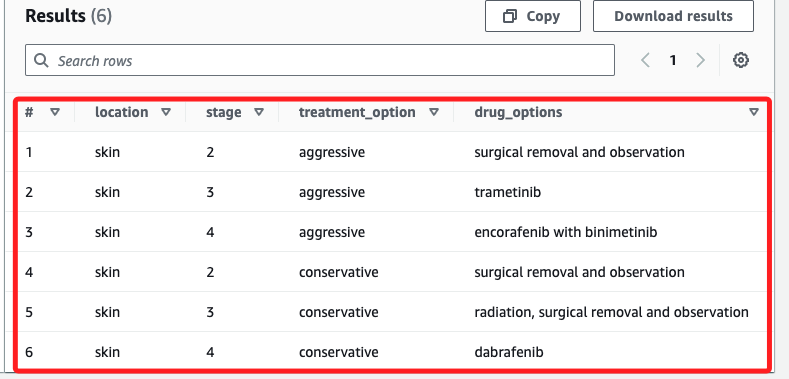

<br>

7. 第一個結果顯示 `不同病人的樣本來源`、`癌症位置`、`突變類型` 以及 `基因的註釋狀況`，這表明患者患有特定的基因突變，特別是 `BRAF 突變`，該突變與 `黑色素瘤` 密切相關；第二個結果顯示 `病人對應的治療選項`、`癌症的階段（stage）`，以及 `具體的藥物選擇`。根據這些結果，可為三位病人（F、S 和 U）提供具體的治療建議；這裡主要是 AWS 的操作，推論部分先略過。

<br>

## Scenario 3: Dr. Santos 的腎癌研究

_問題：Dr. Santos 想知道腎癌患者的非註釋型替換突變，並尋求治療方案。_

<br>

1. 選擇 `Saved queries`，找到名稱為 `4 - All kidney samples` 的查詢並 `運行`。

<br>

2. 再次選擇 `Saved queries`，選擇名稱為 `5 - Calculate kidney VCF` 的查詢，並添加以下條件。

   ```sql
   WHERE location = 'kidney' AND type_2 = 'substitution'
   ```

<br>

3. 再次 `運行`，並添加條件 `排除已註釋的樣本`。

   ```sql
   AND annotated = 'no'
   ```

<br>

4. 根據結果，記下哪些患者有腎癌且存在非註釋型替換突變。

<br>

5. 建立新查詢，輸入以下 SQL 查詢以查找腎癌的治療方案。

   ```sql
   select * from treatments where location = 'kidney'
   ```

<br>

6. 根據結果，為 `Patient J` 和 `Patient P` 提供治療建議；Patient J 需要保守治療（早期第二期）、Patient P 需要更激進的治療（第四期）。

<br>

## Scenario 4: Dr. Owusu 和肺癌患者

_問題：Dr. Owusu 想了解其肺癌患者的性別比例以及哪些患者有 KRAS 突變。_

<br>

1. 建立新查詢，輸入以下 SQL 查詢以查找所有肺癌樣本。

   ```sql
   select * from samples where location = 'lung'
   ```

<br>

2. 運行查詢，寫下肺癌患者的性別比例（男對女）。

<br>

3. 再次選擇 `Saved queries`，選擇 `3 - VCF and samples joined` 的查詢，並修改條件。

   ```sql
   WHERE name = 'KRAS' and location = 'lung'
   ```

<br>

4. 運行查詢，寫下有哪些肺癌患者有 KRAS 突變。

<br>

___

_END_