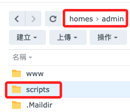
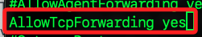
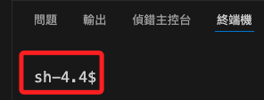
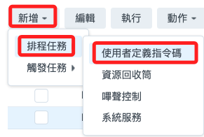
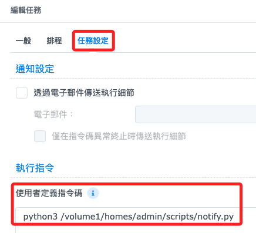
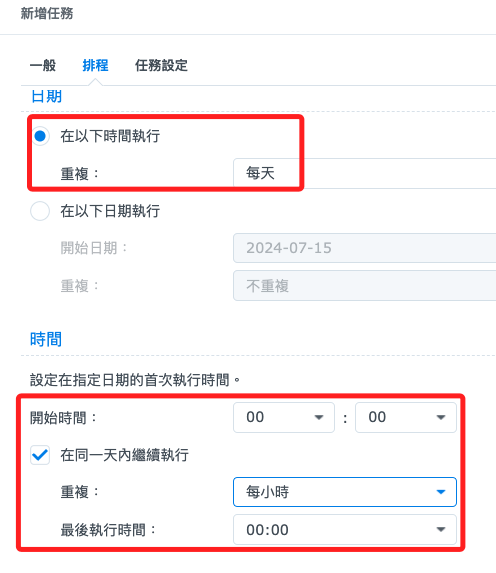
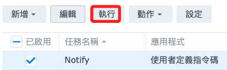

# 定時運行腳本

_在 NAS 寫一個 Python 腳本並定時每小時執行一次_

<br>

## 準備環境

1. 安裝 Python：在套件中心搜尋並安裝 `Python` 套件。

<br>

2. 啟用 SSH：在 `控制台` > `終端機和 SNMP` > `終端機` 中啟用 `SSH 功能`。

<br>

3. 建立資料夾：在 `homes > admin` 內建立一個 `scripts` 資料夾，絕對路徑是 `/volume1/homes/admin/scripts/`。

    

<br>

## 使用 VSCode 連線

1. 使用 SSH 登入 NAS，指令中的 nas 是 NAS IP 的映射，若尚未在 NAS 建立公鑰，登入需要輸入密碼，但不需要二階段驗證。

    ```bash
    ssh sam6238@nas
    ```

<br>

2. 編輯 SSH 設定檔案，開啟以下設定 `AllowTcpForwarding yes`；特別注意，NAS 預設並未安裝 nano，所以使用 vi 進行設定文件編輯。

    ```bash
    sudo vi /etc/ssh/sshd_config
    ```

    

<br>

3. 編輯完畢，使用組合鍵儲存並退出 `shift+:`、`wq`、`ENTER`。

<br>

4. 重新啟動 SSH 服務以應用更改。

    ```bash
    sudo systemctl restart sshd
    ```

<br>

5. 啟動 VSCode 並遠端連線，連線後顯示 `sh4-4$`。

    

<br>

## 編寫 Python 腳本

1. 切換到指定的資料夾，確認可以建立文件並進行儲存，就可以開始編輯腳本了。

    

<br>

2. 編寫腳本內容。

    ```python

    ```

<br>

## 設定定時任務

1. 登入 `控制面板`，前往 `任務排程表`。

<br>

2. 新增排程任務，點擊 `新增` > `排成任務` > `使用者定義指令碼`。

    

<br>

3. 在 `一般` 頁籤中設定 `任務名稱` 及 `使用者帳號`。

    

<br>

4. 在 `任務設定` 頁面，設定 `執行指令`。

    ```bash
    python3 /volume1/homes/admin/scripts/notify.py
    ```

    

<br>

5. 在 `排程` 頁面中，在 `日期` 區塊中選擇 `每天`，在 `時間` 區塊中選擇 `每小時`；按下 `確定` 完成設置。

    

<br>

## 驗證任務

1. 在 `任務排程表` 中可點擊 `執行` 進行測試。

    

<br>

___

_END_
