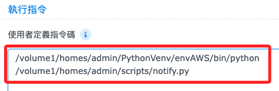

# 建立虛擬環境

<br>

## 查詢

1. 確認使用的是哪種 Shell。

    ```bash
    echo $SHELL
    ```

<br>

2. 建立 `.profile`，NAS 預設並沒有這個文件，要自己建立。

    ```bash
    touch ~/.profile
    ```

<br>

3. 查看文件絕對路徑，位置在 `/var/services/homes/sam6238`。

    ```bash
    cd ~/ && pwd
    ```

<br>

## 編輯腳本。

1. 編輯指令。

    ```bash
    vim ~/.profile
    ```

<br>

2. 寫入內容。

    ```bash
    # 啟動虛擬環境
    if [ -d "/volume1/homes/admin/PythonVenv/envAWS" ]; then
        source /volume1/homes/admin/PythonVenv/envAWS/bin/activate
    fi
    ```

<br>

3. 啟動。

    ```bash
    source ~/.profile
    ```

<br>

## 建立虛擬環境

1. 建立統籌管理資料夾，位置在 `/volume1/homes/admin/PythonVenv`。

    ```bash
    cd /volume1/homes/admin/ && mkdir PythonVenv
    ```

<br>

2. 建立虛擬環境。

    ```bash
    python -m venv envAWS
    ```

<br>

3. 查看虛擬環境啟動路徑。

    ```bash
    /volume1/homes/admin/PythonVenv/envAWS/bin/activate
    ```

<br>

4. 可修改任務中的 `python3` 為虛擬環境路徑。

    ```bash
    /volume1/homes/admin/PythonVenv/envAWS/bin/python /volume1/homes/admin/scripts/notify.py
    ```

    

<br>

___

_END_